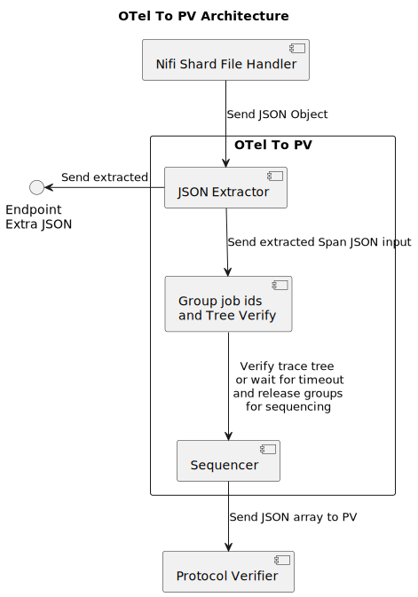

# OpenTelemetry to Protocol Verifier Architecture
## Introduction
The OpenTelemetry to Protocol Verifier (OTelToPV) is a tool that will take in OpenTelemetry data as JSON files and convert it to Protocol Verifier event data. The tool will be implemented in the following three parts that will be event driven:

- JSON Extractor
- Group job ids and Tree Verify
- Sequencer

A Nifi flow will handle the ingestion of shard files handler and will send the JSON line will into the JSON Extractor and a Nifi flow will (this may not be required in the future if the PV uses the same message broker as the tooling here) grab data from the OTeltoPV tool (however this is not part of the OTelToPV tool).

The architecture is show in the diagram below:

## JSON Extractor
The JSON Extractor will:

- Consume JSON data (map or array) from the message broker
- Extract data from the JSON data using a jq string
    - There can be multiple jq strings that can be used to extract the data
- Send the extracted data using multiple producers, one for each jq string, to the message broker or an HTTP endpoint

For the realworld implementation, the JSON sent onto the Group job ids and Tree Verify component will be singular extracted spans with the minimal data required to sequence and transform the spans into Protocol Verifier audit events.

## Group job ids and Tree Verify
The Group job ids and Tree Verify will:

- Consume spans as JSON from the message broker
- Group spans by their trace id field (potentially job id if present across multiple spans)
- Verify the tree structure of the spans under the same trace id
    - If verification fails, send the grouped spans to the Sequencer anyway
- Send the grouped spans as JSON array to the message broker

## Sequencer
The Sequencer will:

- Consume grouped spans as JSON array from the message broker
- Sequence the spans synchronously into Protocol Verifier audit events
    - Sequencing will be performed assuming events are not concurrent i.e. the events are in a causal order and will produce straight line sequences
    - the data that will be received will allow the sequencing to be performed without using timestamps, however, the tool will be able to handle timestamps if that is required
    - For the implmentation logic see [Sequencer Logic](https://github.com/xtuml/otel2puml/blob/main/docs/user/sequencer_HOWTO.md#synchronous-sequencing)
- Send the Protocol Verifier audit events to the message broker

## Logging and Alerting 
Currently the logging and alerting is still to be decided upon. This will be updated in the future.