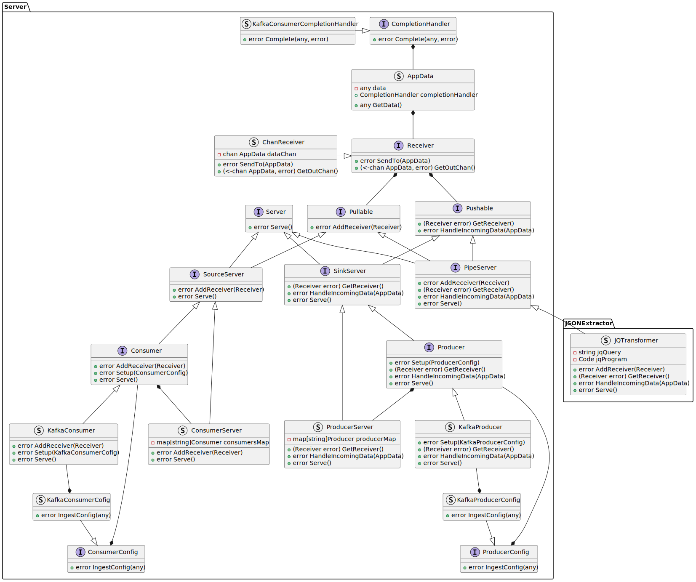

# Design Note 1 - JSON Extractor
## Problem
A tool is required that can extract data from a JSON object. This tool will require: 

- configuration that will allow the user to sepcify the data they want to extract and the final format of the extracted data
- It should provide an interface that allows the user to send a JSON object and receive the extracted data in the specified format as a JSON object

## Solution
### Overview
The proposed solution for the JSON Extractor is:

- An application that can be provided with a configuration file that gives a jq string that will extract the data from the JSON object
- Inner functionality that will use the jq string to compile the jq and extract the data from the JSON object using the library https://pkg.go.dev/github.com/itchyny/gojq
- In regards to the message transaction:
  - The application will provide an interface that allows the application to receive the JSON object
  - The application will provide an interface/s that allows the converted data to be sent to the destination/s

### Configuration
The configuration will be a JSON file detailing:
- the jq string that will be used to extract the data from the JSON object. The configuration will be in the following format:

    ```json
    {
        "jq": "<extraction logic> | {<destination name 1>: <jq variable 1>, <destination name 2>: <jq variable 2>, ...}"
    }
    ```
    - `<extraction logic>` - The jq string that will be used to extract the data from the JSON object
    - `<destination name 1>, <destination name 2>, ...` - The names of the fields that will be used to store the extracted data. These names will be used as the keys in the final JSON object and will also relate to the destination fields
    - `<jq variable 1>, <jq variable 2>, ...` - The jq variables that will be used to store the extracted data. These variables will be used to store the extracted data and will be used in the final JSON object
- the destination/s that the extracted data will be sent to. The configuration will be in the following format:

    ```json
    {
        "destinations": [
            {
                "type": "<destination type>",
                "name": "<destination name>",
                "config": <configuration for destination type>
            }
        ]
    }
    ```
    - `<destination type>` - The type of destination that the extracted data will be sent to. This will be used to determine the destination implementation that will be used
    - `<destination name>` - The name of the destination that the extracted data will be sent to. This will be used to grab the relevant data from the extracted data
    - `<configuration for destination type>` - The configuration for the destination type. This will be used to configure the destination implementation
  
### Conversion functionality
The conversion functionality will be implemented using the library https://pkg.go.dev/github.com/itchyny/gojq. The jq string will be compiled. For each JSON object that is received, the jq will be executed and the extracted data will be stored in a JSON object. The extracted data will be sent onto the transcation handler.

### Message transaction
The message transaction will be split into:

- **Consumption** - It is proposed that the consumption of messages will be implmented using a Kafka Consumer subscribed to a topic. Once data has been processed and sent to the destination, the application will commit the offset of the message.
- **Production** - It is proposed that the production of messages will be implemented using a Kafka Producer that will send the converted data to topic/s defined in the configuration.

### Class Diagram
The class diagram for the JSON Extractor is as follows:



### Implmentation