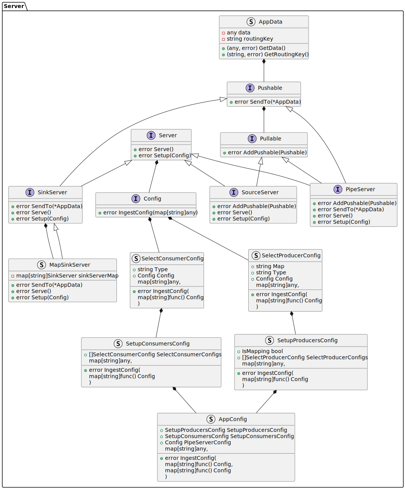
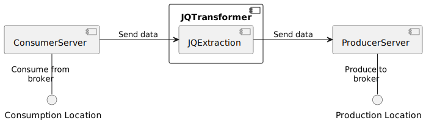
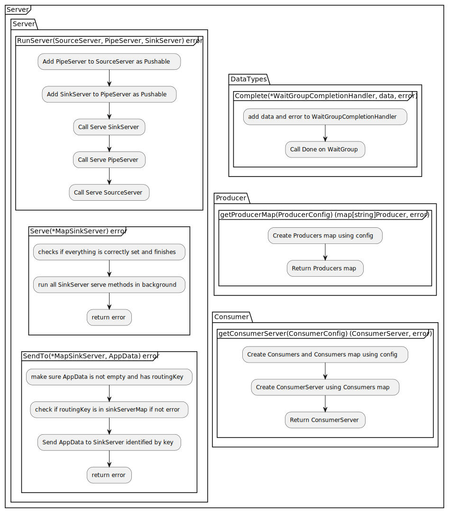

# Design Note 1 - JSON Extractor
## Problem
A tool is required that can extract data from a JSON object. This tool will require: 

- configuration that will allow the user to sepcify the data they want to extract and the final format of the extracted data
- It should provide an interface that allows the user to send a JSON object and receive the extracted data in the specified format as a JSON object

## Solution
### Overview
The proposed solution for the JSON Extractor is:

- An application that can be provided with a configuration file that gives a jq string that will extract the data from the JSON object
- Inner functionality that will use the jq string to compile the jq and extract the data from the JSON object using the library https://pkg.go.dev/github.com/itchyny/gojq
- In regards to the message transaction:
  - The application will provide an interface that allows the application to receive the JSON object
  - The application will provide an interface/s that allows the converted data to be sent to the destination/s

### Configuration
The configuration will be a JSON file detailing:
- the jq string that will be used to extract the data from the JSON object. The configuration will be in the following format:

    ```json
    {
        "jq": "<extraction logic> | {<destination name 1>: <jq variable 1>, <destination name 2>: <jq variable 2>, ...}"
    }
    ```
    - `<extraction logic>` - The jq string that will be used to extract the data from the JSON object
    - `<destination name 1>, <destination name 2>, ...` - The names of the fields that will be used to store the extracted data. These names will be used as the keys in the final JSON object and will also relate to the destination fields
    - `<jq variable 1>, <jq variable 2>, ...` - The jq variables that will be used to store the extracted data. These variables will be used to store the extracted data and will be used in the final JSON object
- the destination/s that the extracted data will be sent to. The configuration will be in the following format:

    ```json
    {
        "destinations": [
            {
                "type": "<destination type>",
                "name": "<destination name>",
                "config": <configuration for destination type>
            }
        ]
    }
    ```
    - `<destination type>` - The type of destination that the extracted data will be sent to. This will be used to determine the destination implementation that will be used
    - `<destination name>` - The name of the destination that the extracted data will be sent to. This will be used to grab the relevant data from the extracted data
    - `<configuration for destination type>` - The configuration for the destination type. This will be used to configure the destination implementation
- the consumer locations that data will be pulled from. The configuration will be in the following format:

    ```json
    {
        "consumers": [
            {
                "type": "<consumer type>",
                "name": "<consumer name>",
                "config": <configuration for consumer type>
            }
        ]
    }
    ```
    - `<consumer type>` - The type of consumer that the data will be pulled from. This will be used to determine the consumer implementation that will be used
    - `<consumer name>` - The name of the consumer that the data will be pulled from. This will be used to grab the relevant data from the extracted data
    - `<configuration for consumer type>` - The configuration for the consumer type. This will be used to configure the consumer implementation
  
### Conversion functionality
The conversion functionality will be implemented using the library https://pkg.go.dev/github.com/itchyny/gojq. The jq string will be compiled. For each JSON object that is received, the jq will be executed and the extracted data will be stored in a JSON object. The extracted data will be sent onto the transcation handler.

### Message transaction
The message transaction will be split into:

- **Consumption** - It is proposed that the consumption of messages will be implmented using a Kafka Consumer subscribed to a topic. Once data has been processed and sent to the destination, the application will commit the offset of the message.
- **Production** - It is proposed that the production of messages will be implemented using a Kafka Producer that will send the converted data to topic/s defined in the configuration.

### Class Diagram
The class diagram for the JSON Extractor is as follows - this is split into two parts for clarity: 

- Server - Server library that will provide the functionality for receiving, and sending messages and provide the interface to build the conversion functionality
- JSON Extractor app - Application that will use the Server library to provide the server runnning functionality and will also contain the conversion functionality



### Architecture Overview
The task falls into two main parts:

- Server - Server library that will provide the functionality for receiving, and sending messages and provide the interface to build the conversion functionality
- JSON Extractor - Application that will use the Server library to provide the server runnning functionality and will also contain the conversion functionality

Below is the proposed architecture for the full JSON Extractor application that build upon the server architecture.

#### Server

The server architecture will be setup such that there are three main components that are linked together sending and receiving data:

- **SourceServer** - This is where data "originates" from. The SourceServer will accept a Receiver instance that will be used to send data to the next component in the chain. The SourceServer will also have a method to start the server.
- **PipeServer** - This is the middle component that will provide the Receiver instance to the SourceServer. The Pipe server can then pull data from a channel setup in the background of the Receiver instance. The Pipe server will accept a Receiver instance that will be used to send data to the next component in the chain. The PipeServer will also have a method to start the server.
- **SinkServer** - This is the final component that will receive the data. The SinkServer will provide a Receiver instance to the PipeServer. The SinkServer will also have a method to start the server.


This provides the functionality to send data across the application.

#### JSON Extractor App

The JSON Extractor app will use the server library to provide the server running functionality and will also contain the conversion functionality. The JSON Extractor app will be setup such that there are three main components that are linked together sending and receiving data:

- **ConsumerServer** - This is where data "originates" from and it will pull data down from a broker. The ConsumerServer will accept a Receiver instance that will be used to send data to the next component in the chain, the JQTransformer. The ConsumerServer will also have a method to start the server.

- **JQTransformer** - This is the middle component that will provide the Receiver instance to the ConsumerServer. The JQTransformer will accept a Receiver instance that will be used to send data to the next component in the chain, the ProducerServer. The JQTransformer will pull data from the Receiver instance and use the compiled jq string to extract the data. The JQTransformer will then send the extracted data to the ProducerServer. The JQTransformer will also have a method to start the server.

- **ProducerServer** - This is the final component that will send on the data to the broker. The ProducerServer will provide a Receiver instance to the JQTransformer. The ProducerServer will also have a method to start the server.



This provides the functionality to send data across the application.

### Class Diagram
The class diagram for the JSON Extractor are as follows - split into the following two parts as before: 

- Server
- JSON Extractor


### Functional Implementation
As has been outlined above, the JSON Extractor will be implemented in two parts:

- Server
- JSON Extractor

The server will provide the functionality to send and receive messages. The JSON Extractor app will provide the functionality to convert the messages.

#### Server

The following is an overview of the server implementation:



#### JSON Extractor App

The following is an overview of the JSON Extractor app implementation:

