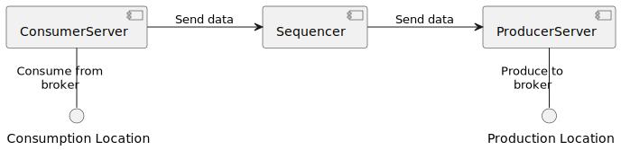
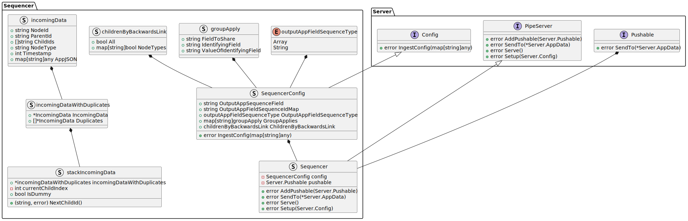

# Design Note 2: Sequencer
## Problem
A tool is required that can take a tree (call graph) of linked data and return a causal sequence of the data. The data will have either of the following bits of information:
- each node will have a timestamp of when the node completed its processing and a link to the parent node that called it
- each node will have an orderdered list of nodes that it called i.e. the children nodes (note if some don't have a link to their child nodes they can either only have one child that knows its parent or they are considered a leaf node)

The tool will only sequence the data in a straight line sequence i.e. a node will only have a single parent (except the start node) and a single child (except the end node).

The tool is also required to output the data in a format ingestible by the Protocol Verifier i.e. Protocol Verifier audit event sequences. Therefore each "Audit Event" must currently follow the following structure:
```json
{
    "jobName": "<string>",
    "jobId": "<UUID>",
    "eventId": "<UUID>",
    "eventType": "<string>",
    "timestamp": "<timestamp ISO string>",
    "applicationName": "<string>",
    "previousEventIds": ["<UUID>"],
    <arbitrary non-conflicting fields>
}
```

Therefore there should be a way to map the incoming data to the above structure.

## Solution
### Overview
The proposed solution for the Sequencer is:
- An application that can be provided with configuration that will specify the format of the incoming data and the format of the outgoing data (the data can be sent as a JSON array of JSON objects or as singular JSON objects)
- Inner functionality that will use the configuration to compile the data and sequence the data
- In regards to the message transaction:
  - The application will provide an interface that allows the application to receive the data
  - The application will provide an interface/s that allows the sequenced data to be sent to the destination/s

### Sequencing Logic
The sequencing logic will follow the synchronous sequencing logic as described in [Otel2PUML: Synchronous Sequencing](https://github.com/xtuml/otel2puml/blob/main/docs/user/sequencer_HOWTO.md#synchronous-sequencing). However the ordering of children can also be determined by the ordered list of children that a node has.

### Message Transaction
Covered in [Design Note 1](/docs/design_notes/DN1_JSON_Extractor/DN1_JSON_Extractor.md#Message-Transaction).

### Incoming Data Format
The incoming data will be required have the following format:
```json
[
    {
        "<tree id field name>": "<string>",
        "<node id field name>": "<string>",
        "<timestamp field name>": "<specified timestamp format>",
        "<parent id field name>": "<string>",
        "<children field name>": ["<string>"],
        <arbitrary non-conflicting fields>
    },
    ...
]
```
The arbitrary fields can be set in the configuration and will be used to set fields in the output data.

### Outgoing Data Format
The outgoing data will be an array of JSON objects that follow the Protocol Verifier audit event sequences format as described in the Problem section (for now). However, it is envisaged that this format may develop in the future and therefore the configuration will allow for the mapping of the incoming data to the outgoing data. For now however the outgoing data will be in the following format as an array of JSON objects:
```json
[
    {
        "jobName": "<string>",
        "jobId": "<UUID>",
        "eventId": "<UUID>",
        "eventType": "<string>",
        "timestamp": "<timestamp ISO string>",
        "applicationName": "<string>",
        "previousEventIds": ["<UUID>"],
        <arbitrary non-conflicting fields>
    },
    ...
]
```

### Architecture Overview

The Sequencer app will use the server library to provide the server running functionality and will also contain the conversion functionality. The Sequencer app will be setup such that there are three main components that are linked together sending and receiving data:


- **ConsumerServer** - This is where data "originates" from and it will pull data down from a broker. The ConsumerServer will accept the Sequencer instance (a Pushable) to send data to. The ConsumerServer will also have a method to start the server.

- **Sequencer** - This is the middle component that will receive data from the ConsumerServer. The Sequencer will accept the ProducerServer (a Pushable). The Sequencer will use the configuration to sequence the data and convert the data into the outgoing format. The Sequencer will then send the sequenced data to the ProducerServer. The Sequencer will also have a method to start the server.

- **ProducerServer** - This is the final component that will send on the data to the broker. The ProducerServer will receive data from the Sequencer. The ProducerServer will also have a method to start the server.



### Class Diagram
The class diagram for the Sequencer is as follows:

