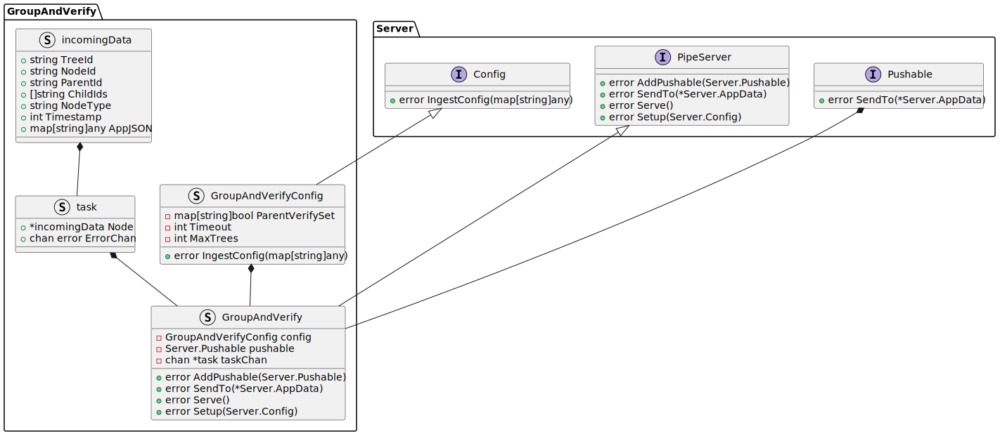

# Design Note 3: Group And Verify
## Problem
A tool is required that can group incoming extracted trace data that are provided in the forms of trees. These trees can have a parent connection and children connection (in the form of a list of children). The tool will group the data into a single trees and verify that the trees are valid i.e. make sure that all bi-directional links agree.

## Solution
### Overview
The proposed solution for the Group And Verify tool is:
- An application that can be provided with configuration that will specify the format of the incoming data and the format of the outgoing data. the incoming data will be singular JSON objects. The outgoing data will be in the form of a JSON array of JSON objects.
- Inner functionality that will use the configuration to compile the data and group the data
- In regards to the message transaction:
  - The application will provide an interface that allows the application to receive the data
  - The application will provide an interface/s that allows the grouped data to be sent to the destination/s

### Grouping Logic
To group the data the tool will:
- Create a dictionary of trees where the key is the tree id and the value is a map of string:
    - map of node id to node (under key "nodes")
    - map of edge id to edge (under key "edges")
- For each incoming node:
    - create a wait group for the node
    - look for the tree that the node belongs to
    - if the tree does not exist:
        - create tree
        - add tree to the dictionary of trees
        - create timer for tree
    - add the node to the map of nodes
    - get all the links from/to the node and then for each link:
        - if the link is a parent link and the node type is has no forward link to it (from config):
            - do both steps below and assume bi-directionality
        - see if edge exists between the node and the parent node 
        - if edge does not exist:
            - create edge
            - add edge to the map of edges
            - add 1 to internal count for edge
        - if edge does exist:
            - add 1 to the bi-directional link count
            - add 1 to the internal count for edge (check if this exceeds 2)
    - if bi-directional link count equals the number of edges:
        - stop timer for tree
        - send tree to the producer
        - once sent finish all the wait groups for the nodes in the tree
- if timer for tree exceeds the timeout:
    - send tree to the producer as is - notify that the tree is incomplete
    - once sent finish all the wait groups for the nodes in the tree
- (if required) for "finished" trees order the children of the nodes in the tree by the timestamp field
- (if required) for "finished" trees update any of the appJSON fields with the relevant information from particular nodes

### Message Transaction
Covered in [Design Note 1](/docs/design_notes/DN1_JSON_Extractor/DN1_JSON_Extractor.md#Message-Transaction).

### Incoming Data Format
The incoming data will be required have the following format:
```json
{
    "treeId": "<string>",
    "nodeId": "<string>",
    "parentNodeId": "<string>",
    "childIds": ["<string>"],
    "nodeType": "<string>",
    "timestamp": "<timestamp field>",  // optional
    "appJSON": {
        <arbitrary fields>
    } 
}
```
The appJSON is arbitrary JSON object that holds the data that the user wants to be passed through the system (this can be updated by the system).

The `timestamp` field is optional and is used to order the children in the tree. If the config specifies that the children should be ordered by timestamp then the children will be ordered by the timestamp field, otherwise the children are are assumed to be in the order they appear in the `childIds` list.

The `nodeType` field is used to determine if the node has a forward link to it. If the node type is in the list of node types that do not have a forward link to them then within the code this node will be assumed to have a forward link to it.

### Outgoing Data Format
So that data can be passed to the sequencer the outgoing data will be in the following format (an array of JSON objects):
```json
[
    {
        "nodeId": "<string>",
        "orderedChildIds": ["<string>"],
        "appJSON": {
            <arbitrary fields>
        } 
    },
    ...
]
```

### Architecture Overview

The Group and Verify app will use the server library to provide the server running functionality and itself will contain the grouping functionality. The Group and Verify app will be setup such that there are three main components that are linked together sending and receiving data:

- **ConsumerServer** - This is where data "originates" from and it will pull data down from a broker. The ConsumerServer will accept the Group and Verify instance (a Pushable) to send data to. The ConsumerServer will also have a method to start the server.

- **Group and Verify** - This is the middle component that will receive data from the ConsumerServer. The Group and Verify component will accept the ProducerServer (a Pushable). The Group and Verify component will use the configuration to group and verify the data and convert it into the outgoing format. The Group and Verify component will then send the sequenced data to the ProducerServer. The Group and Verify component will also have a method to start the server.

- **ProducerServer** - This is the final component that will send on the data to the broker. The ProducerServer will receive data from the Group and Verify component. The ProducerServer will also have a method to start the server.


### Class Diagram
The class diagram for the Group and Verify component is as follows:



### Implementation
The implmentation of the GroupAndVerify struct is as follows in the activity diagram:

