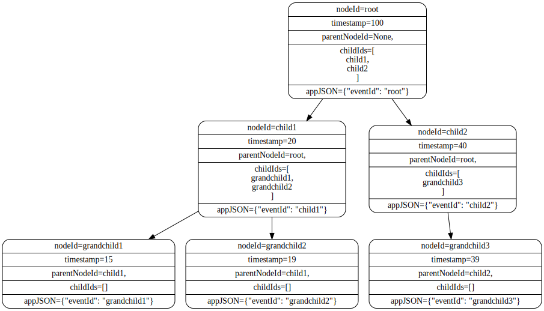
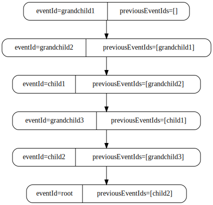

# Sequencer User Manual

## Introduction
The Sequencer is an application that will sequence tree like linked logs i.e. OTel Traces (https://opentelemetry.io/docs/concepts/signals/traces/). The data will be ingested as an array of JSON objects and sequenced into a causal sequence of the data. There are two possibilities for how this data can be sequenced:
- (Default) Each parent node will have an ordered list of child nodes that are assumed to occur in their position in the list. Parent nodes occur after all their children have occurred. This provides a simple way to sequence the data.
- (Optional) Each node will have a timestamp of when the node completed its processing and a link to the parent node that called it. The children of a node can be ordered by their timestamp field. This provides a fallback way to sequence the data if required.

The sequencer will only sequence the data in a straight line sequence i.e. a node will only have a single parent (except the start node) and a single child (except the end node).

The sequencers current usage is a to output sequenced data (an array) in a format ingestible by the [Protocol Verifier](https://github.com/xtuml/munin) i.e. Protocol Verifier audit event sequences. Therefore the output should be an array of "Audit Events" with the following structure:
```json
[
    {
        "jobName": "<string>",
        "jobId": "<UUID>",
        "eventId": "<UUID>",
        "eventType": "<string>",
        "timestamp": "<timestamp ISO string>",
        "applicationName": "<string>",
        "previousEventIds": ["<UUID>"],
        <arbitrary non-conflicting fields>
    },
    ...
]
```
However, the sequencer can be used to sequence data for any purpose as long as the input data is in the correct format.

The workflow of the Sequencer is shown in the following diagram:


## Input Data Format
The incoming data will be required to be an array of grouped tree data (e.g. OTel Traces) with the following format:
```json
[
    {
        "treeId": <string>, // optional
        "nodeId": <string>,
        "parentNodeId": <string>, // optional, only required if the data is to be sequenced by parentNodeId and then ordered by timestamp, used in conjunction with timestamp
        "childIds": [<string>, ...], // optional, only required if the data is to be sequenced by childIds
        "nodeType": <string>, // optional, only required if the particular nodetypes children are found by parentNodeId and then ordered by timestamp
        "timestamp": "<int>", // optional, only required if the data is to be sequenced by timestamp, used in conjunction with parentNodeId
        "appJSON": {
            <arbitrary fields>
        } 
    },
    ...
]
```
For the example of OTel Traces:
- `treeId` is the `trace_id` of the trace
- `nodeId` is the `span_id` of the span
- `parentNodeId` is the `parent_span_id` of the span
- `timestamp` is the `end_time_unix_nano` of the span

The `appJSON` is arbitrary JSON object that holds the data that the user wants to be passed through the system (this can be updated by the system). The sequencer will add a specified (in config) field to the `appJSON` object that will hold the reference to the previous node in the sequence. For the example of Protocol Verifier audit event sequences this field will be `previousEventIds` and will hold the `eventId` of the previous event in the sequence within an array. An example of the input `appJSON` object for the Protocol Verifier is:
```json
{
    "jobName": "<string>",
    "jobId": "<UUID>",
    "eventId": "<UUID>",
    "eventType": "<string>",
    "timestamp": "<timestamp ISO string>",
    "applicationName": "<string>",
    <arbitrary non-conflicting fields>
}
```
It is important to note that the `previousEventIds` field will be added to the `appJSON` object by the sequencer and will not be present in the incoming data.

## Output Data Format
The sequencer will output the sequenced data in the following format (an array of the `appJSON` objects updated with the previous node id):
```json
[
    {
        <arbitrary fields>,
        <specified field for the previous node in the sequence>: <formatted previous node id>
    },
    ...
]
```
In the example of Protocol Verifier audit event sequences the `appJSON` object will be the `Audit Event` object and the `specified field for the previous node in the sequence` will be `previousEventIds` and the `formatted previous node id` will be the `eventId` of the previous event in the sequence.
```json
[
    {
        "jobName": "<string>",
        "jobId": "<UUID>",
        "eventId": "<UUID>",
        "eventType": "<string>",
        "timestamp": "<timestamp ISO string>",
        "applicationName": "<string>",
        "previousEventIds": ["<UUID>"],
        <arbitrary non-conflicting fields>,
    },
    ...
]
```
## Sequencer Logic
The sequencer basic logic can be found in the [Otel2PUML: Synchronous Sequencing](https://github.com/xtuml/otel2puml/blob/main/docs/user/sequencer_HOWTO.md#synchronous-sequencing).

There are two possibilities for how this data can be sequenced:
- (Default) Each parent node will have an ordered list of child nodes (`childIds`) that are assumed to occur in their position in the list. Parent nodes occur after all their children have occurred. This provides a simple way to sequence the data.
- (Optional) Each node will have a timestamp of when the node completed its processing and a link to the parent node (`parentNodeId`) that called it. The children of a node can be ordered by their `timestamp` field. This provides a fallback way to sequence the data if required.

The sequencer will only sequence the data in a straight line sequence i.e. a node will only have a single parent (except the start node) and a single child (except the end node).

An example is show below of how a simple tree would be sequenced with the following diagrams:



is sequenced to



Notice how the output is a sequence of the data with the `previousEventIds` field added to the `appJSON` object (Protocol Verifier audit event sequences).
## Group Apply Feature
The Sequencer has another feature that, if configured, to:
1. grab the value of a specified field from one of the `appJSON`'s using the value of another field in the `appJSON` as the method to identify the correct `appJSON`.
2. apply the found value to the specified field in all the other `appJSON`'s.

## Installation
### Building from Source
Prerequisites:
- Docker
- Internet connection

The docker compose file for the application (`Sequencer/deploy/docker-compose.yml` - relative to the rooot of the repository) can be used to build the application. The application can be built using the following sequence of commands:
```bash
cd Sequencer/deploy
docker compose build
```
### GitHub Container Registry
Prerequisites:
- Docker
- Internet connection

The Sequencer tool is available as a Docker image. The image is available on the GitHub Container Registry (TODO: Add link). This image can be pulled using the following command:
- `docker pull ghcr.io/xtuml/sequencer:latest`

## Configuration

A configuration file must be provided to the JQExtractor for it to run. The configuration file is a JSON file that has the following structure:
```json
{
    "AppConfig": <configuration for the application>,
    "ProducersSetup": <configuration for the producers to send the output to>,
    "ConsumersSetup": <configuration for the consumers to receive the input from - currently only works for a single consumer>
}
```

### AppConfig

The `AppConfig` section of the configuration file is used to configure the Sequencer application. The configuration has the following structure:
```json
{
    "outputAppSequenceField": <string - the field in the appJSON object that will hold the reference to the previous node identifier in the sequence>,
    "outputAppFieldSequenceIdMap": <string, optional - the field in the appJSON object that will be used to populate the outputAppSequenceField. If left empty the outputAppSequenceField will be populated with the nodeId>,
    "outputAppFieldSequenceType" <string, optional - one of "array" (value for outputAppSequenceField is held inside array) or "string" (value for outputAppSequenceField is held as a string), default is "array">,
    "groupApplies": <array, optional - array of objects that contain information about the application of a field from one `appJSON` to all others>,
    "childrenByBackwardsLink": <object, optional - an object that contains information about using the parentNodeId field and timestamp field to sequence the data>,
}
```

The `outputAppSequenceField` is the field in the `appJSON` object that will hold the reference to the previous node identifier in the sequence. This field will be added to the `appJSON` object by the sequencer and will not be present in the incoming data.

The `outputAppFieldSequenceIdMap` is the field in the `appJSON` object that will be used to populate the `outputAppSequenceField`. If left empty the `outputAppSequenceField` will be populated with the `nodeId`.

The `outputAppFieldSequenceType` is one of "array" or "string". If "array" the value for `outputAppSequenceField` is held inside an array. If "string" the value for `outputAppSequenceField` is held as a string. The default is to use "array".

An example for these three fields in the config could be (as applied to the Protocol Verifier audit event sequences):
```json
{
    "outputAppSequenceField": "previousEventIds",
    "outputAppFieldSequenceIdMap": "eventId",
    "outputAppFieldSequenceType": "array"
}
```
If the input to the app was the following tree with two nodes:
```json
[
    {
        "nodeId": "1",
        "childNodeId": ["2"],
        "appJSON": {
            "jobName": "job1",
            "jobId": "jobId1",
            "eventId": "eventId1",
            "eventType": "eventType1",
            "timestamp": "2021-01-01T00:00:00Z",
            "applicationName": "app1"
        }
    },
    {
        "nodeId": "2",
        "appJSON": {
            "jobName": "job",
            "jobId": "jobId",
            "eventId": "eventId2",
            "eventType": "eventType2",
            "timestamp": "2021-01-01T00:00:01Z",
            "applicationName": "app2"
        }
    }
]
```
The output would then be given the configuration:
```json
[
    {
        "jobName": "job1",
        "jobId": "jobId1",
        "eventId": "eventId1",
        "eventType": "eventType1",
        "timestamp": "2021-01-01T00:00:01Z",
        "applicationName": "app1",
        "previousEventIds": ["eventId2"]
    },
    {
        "jobName": "job",
        "jobId": "jobId",
        "eventId": "eventId2",
        "eventType": "eventType2",
        "timestamp": "2021-01-01T00:00:00Z",
        "applicationName": "app2",
        "previousEventIds": []
    }
]
```

### groupApplies

The `groupApplies` section of the configuration file is used to configure the Group Apply feature of the Sequencer. It is provided as an array of the objects that contain information about the application of a field from one `appJSON` to all others. The configuration for a single member of the `groupApplies` array has the following structure:
```json
{
    "FieldToShare": <string - the field in the appJSON object that will be shared with all other appJSON objects>,
    "IdentifyingField": <string - the field in the appJSON object that will be used to identify the correct appJSON object to share the value of FieldToShare with>,
    "ValueOfIdentifyingField": <string - the value of the IdentifyingField that will be used to identify the correct appJSON object to share the value of FieldToShare with>,
}
```

An example of the `groupApplies` configuration could be (as applied to the Protocol Verifier audit event sequences):
```json
{
    "groupApplies": [
        {
            "FieldToShare": "jobName",
            "IdentifyingField": "eventType",
            "ValueOfIdentifyingField": "eventType1"
        }
    ]
}
```

If the input to the app was the following tree with two nodes:
```json
[
    {
        "nodeId": "1",
        "childNodeId": ["2"],
        "appJSON": {
            "jobName": "job1",
            "jobId": "jobId1",
            "eventId": "eventId1",
            "eventType": "eventType1",
            "timestamp": "2021-01-01T00:00:00Z",
            "applicationName": "app1"
        }
    },
    {
        "nodeId": "2",
        "appJSON": {
            "jobName": "job",
            "jobId": "jobId",
            "eventId": "eventId2",
            "eventType": "eventType2",
            "timestamp": "2021-01-01T00:00:01Z",
            "applicationName": "app2"
        }
    }
]
```
The output would then be given the configuration:
```json
[
    {
        "jobName": "job1",
        "jobId": "jobId1",
        "eventId": "eventId1",
        "eventType": "eventType1",
        "timestamp": "2021-01-01T00:00:01Z",
        "applicationName": "app1",
        "previousEventIds": ["eventId2"]
    },
    {
        "jobName": "job1",
        "jobId": "jobId",
        "eventId": "eventId2",
        "eventType": "eventType2",
        "timestamp": "2021-01-01T00:00:00Z",
        "applicationName": "app2",
        "previousEventIds": [],
    }
]
```
As can be seen the job name of the first node has been applied to the second node, replacing its value.

**Note:** If the `groupApplies` feature is used it is important to ensure the following:

1. That each `groupApplies` does not conflict with another `groupApplies` i.e. if the `FieldToShare` is the same in two `groupApplies` then your data is split in such a way that this will not cause a conflict due to the fact that the first instance will be applied and the second instance will not be used, for each unique `FieldToShare`.
2. That the `IdentifyingField` and `ValueOfIdentifyingField` are unique to the `appJSON` object that you want to share the `FieldToShare` with or the duplication is intended.

### childrenByBackwardsLink

The `childrenByBackwardsLink` section of the configuration file is used to configure the sequencing of the data by the parentNodeId field and timestamp field. It is an object that details how this will be configured. The structure of this object is:
```json
{
    "all": <boolean, optional - if true all nodes will be sequenced by the parentNodeId field and timestamp field, ignoring the values in nodeTypes field, if false only nodes with a particular nodeType will be sequenced by the parentNodeId field and timestamp field, default is false>,
    "nodeTypes": <array of strings, optional - the nodeTypes whose children will be sequenced by the parentNodeId field and timestamp field>,
}
```
#### Examples
##### Case 1: single node type identfied and children sequenced by parentNodeId field and timestamp field
An example of the `childrenByBackwardsLink` configuration could be:
```json
{
    "childrenByBackwardsLink": {
        "all": false,
        "nodeTypes": ["nodeType1"]
    }
}
```
If the input to the app was the following tree with three nodes:
```json
[
    {
        "nodeId": "1",
        "nodeType": "nodeType1",
        "timestamp": 3,
        "appJSON": {
            "jobName": "job",
            "jobId": "jobId",
            "eventId": "eventId1",
            "eventType": "eventType1",
            "timestamp": "2021-01-01T00:00:03Z",
            "applicationName": "app1"
        }
    },
    {
        "nodeId": "2",
        "parentNodeId": "1",
        "timestamp": 1,
        "appJSON": {
            "jobName": "job",
            "jobId": "jobId",
            "eventId": "eventId2",
            "eventType": "eventType2",
            "timestamp": "2021-01-01T00:00:01Z",
            "applicationName": "app2"
        }
    },
    {
        "nodeId": "3",
        "parentNodeId": "1",
        "timestamp": 2,
        "appJSON": {
            "jobName": "job",
            "jobId": "jobId",
            "eventId": "eventId3",
            "eventType": "eventType1",
            "timestamp": "2021-01-01T00:00:02Z",
            "applicationName": "app3"
        }
    }
]
```
The output would then be given the configuration:
```json
[
    {
        "jobName": "job",
        "jobId": "jobId",
        "eventId": "eventId2",
        "eventType": "eventType2",
        "timestamp": "2021-01-01T00:00:01Z",
        "applicationName": "app2",
    },
    {
        "jobName": "job",
        "jobId": "jobId",
        "eventId": "eventId3",
        "eventType": "eventType3",
        "timestamp": "2021-01-01T00:00:02Z",
        "applicationName": "app3",
        "previousEventIds": ["eventId2"]
    },
    {
        "jobName": "job",
        "jobId": "jobId",
        "eventId": "eventId1",
        "eventType": "eventType1",
        "timestamp": "2021-01-01T00:00:03Z",
        "applicationName": "app1",
        "previousEventIds": ["eventId3"]
    },
]
```
As can be seen the nodes have been sequenced by the parentNodeId field and timestamp field.

##### Case 2: all nodes sequenced by parentNodeId field and timestamp field
An example of the `childrenByBackwardsLink` configuration could be:
```json
{
    "childrenByBackwardsLink": {
        "all": true,
    }
}
```
`all` set to true will ignore all values in the `nodeTypes` field and sequence all nodes by the parentNodeId field and timestamp field.

If the input to the app was the following tree with three nodes:
```json
[
    {
        "nodeId": "1",
        "nodeType": "nodeType1",
        "timestamp": 3,
        "appJSON": {
            "jobName": "job",
            "jobId": "jobId",
            "eventId": "eventId1",
            "eventType": "eventType1",
            "timestamp": "2021-01-01T00:00:03Z",
            "applicationName": "app1"
        }
    },
    {
        "nodeId": "2",
        "parentNodeId": "1",
        "timestamp": 1,
        "appJSON": {
            "jobName": "job",
            "jobId": "jobId",
            "eventId": "eventId2",
            "eventType": "eventType2",
            "timestamp": "2021-01-01T00:00:01Z",
            "applicationName": "app2"
        }
    },
    {
        "nodeId": "3",
        "parentNodeId": "1",
        "timestamp": 2,
        "appJSON": {
            "jobName": "job",
            "jobId": "jobId",
            "eventId": "eventId3",
            "eventType": "eventType1",
            "timestamp": "2021-01-01T00:00:02Z",
            "applicationName": "app3"
        }
    }
]
```
The output would then be given the configuration:
```json
[
    {
        "jobName": "job",
        "jobId": "jobId",
        "eventId": "eventId2",
        "eventType": "eventType2",
        "timestamp": "2021-01-01T00:00:01Z",
        "applicationName": "app2",
    },
    {
        "jobName": "job",
        "jobId": "jobId",
        "eventId": "eventId3",
        "eventType": "eventType3",
        "timestamp": "2021-01-01T00:00:02Z",
        "applicationName": "app3",
        "previousEventIds": ["eventId2"]
    },
    {
        "jobName": "job",
        "jobId": "jobId",
        "eventId": "eventId1",
        "eventType": "eventType1",
        "timestamp": "2021-01-01T00:00:03Z",
        "applicationName": "app1",
        "previousEventIds": ["eventId3"]
    },
]
```
As can be seen the nodes have been sequenced by the parentNodeId field and timestamp field even though no nodeTypes were specified.

##### Case 3: Mixture of nodeTypes with children sequenced by parentNodeId field and timestamp field and others by childIds

An example of the `childrenByBackwardsLink` configuration could be:
```json
{
    "childrenByBackwardsLink": {
        "all": false,
        "nodeTypes": ["nodeType1"]
    }
}
```
If the input to the app was the following tree with five nodes:
```json
[
    {
        "nodeId": "1",
        "nodeType": "nodeType1",
        "timestamp": 5,
        "appJSON": {
            "jobName": "job",
            "jobId": "jobId",
            "eventId": "eventId1",
            "eventType": "eventType1",
            "timestamp": "2021-01-01T00:00:05Z",
            "applicationName": "app1"
        }
    },
    {
        "nodeId": "2",
        "parentNodeId": "1",
        "timestamp": 4,
        "appJSON": {
            "jobName": "job",
            "jobId": "jobId",
            "eventId": "eventId2",
            "eventType": "eventType2",
            "timestamp": "2021-01-01T00:00:04Z",
            "applicationName": "app2"
        }
    },
    {
        "nodeId": "3",
        "parentNodeId": "1",
        "timestamp": 3,
        "childIds": ["5", "4"],
        "appJSON": {
            "jobName": "job",
            "jobId": "jobId",
            "eventId": "eventId3",
            "eventType": "eventType3",
            "timestamp": "2021-01-01T00:00:03Z",
            "applicationName": "app3"
        }
    },
    {
        "nodeId": "4",
        "appJSON": {
            "jobName": "job",
            "jobId": "jobId",
            "eventId": "eventId4",
            "eventType": "eventType4",
            "timestamp": "2021-01-01T00:00:02Z",
            "applicationName": "app4"
        }
    },
    {
        "nodeId": "5",
        "appJSON": {
            "jobName": "job",
            "jobId": "jobId",
            "eventId": "eventId5",
            "eventType": "eventType5",
            "timestamp": "2021-01-01T00:00:01Z",
            "applicationName": "app5"
        }
    }
]
```
The output would then be given the configuration:
```json
[
    {
        "jobName": "job",
        "jobId": "jobId",
        "eventId": "eventId5",
        "eventType": "eventType5",
        "timestamp": "2021-01-01T00:00:01Z",
        "applicationName": "app5",
    },
    {
        "jobName": "job",
        "jobId": "jobId",
        "eventId": "eventId4",
        "eventType": "eventType4",
        "timestamp": "2021-01-01T00:00:02Z",
        "applicationName": "app4",
        "previousEventIds": ["eventId5"]
    },
    {
        "jobName": "job",
        "jobId": "jobId",
        "eventId": "eventId3",
        "eventType": "eventType3",
        "timestamp": "2021-01-01T00:00:03Z",
        "applicationName": "app3",
        "previousEventIds": ["eventId4"]
    },
    {
        "jobName": "job",
        "jobId": "jobId",
        "eventId": "eventId2",
        "eventType": "eventType2",
        "timestamp": "2021-01-01T00:00:04Z",
        "applicationName": "app2",
        "previousEventIds": ["eventId3"]
    },
    {
        "jobName": "job",
        "jobId": "jobId",
        "eventId": "eventId1",
        "eventType": "eventType1",
        "timestamp": "2021-01-01T00:00:05Z",
        "applicationName": "app1",
        "previousEventIds": ["eventId2"]
    },
]
```

### ProducersSetup

The `ProducersSetup` section of the configuration file is used to configure the producer that the Sequencer will send the output to. The configuration has the following structure:
```json
{
    "IsMapping": <boolean - not used by the Sequencer>,
    "ProducerConfigs": <array of objects that contain the fields: Type, ProducerConfig>,
}
```

The objects in the `ProducerConfigs` array have the following structure:
```json
{
    "Type": <string - the type of producer to use. From a set list of types>,
    "ProducerConfig": <object - the configuration for the producer>,
}
```

The `Type` field and corresponding `ProducerConfig` object are dependent on the type of producer. These can be found in the [Producers Documentation](/docs/user/Producers_User_Manual.md).

### ConsumersSetup

The `ConsumersSetup` section of the configuration file is used to configure the consumer that the Sequencer will receive the input from. The configuration has the following structure:
```json
{
    "ConsumerConfigs": <array of objects that contain the fields: Type, ConsumerConfig>,
}
```

The objects in the `ConsumerConfigs` array have the following structure:
```json
{
    "Type": <string - the type of consumer to use. From a set list of types>,
    "ConsumerConfig": <object - the configuration for the consumer>,
}
```

The `Type` field and corresponding `ConsumerConfig` object are dependent on the type of consumer. These can be found in the [Consumer Documentation](/docs/user/Consumers_User_Manual.md).

### Example Configuration

An example configuration file is as follows:
```json
{
    "AppConfig": {
        "outputAppSequenceField": "previousEventIds",
        "outputAppFieldSequenceIdMap": "eventId",
        "outputAppFieldSequenceType": "array",
        "groupApplies": [
            {
                "FieldToShare": "jobName",
                "IdentifyingField": "eventType",
                "ValueOfIdentifyingField": "eventType1"
            }
        ],
        "childrenByBackwardsLink": {
            "all": false,
            "nodeTypes": ["nodeType1"]
        }
    },
    "ProducersSetup": {
        "IsMapping": false,
        "ProducerConfigs": [
            {
                "Type": "AMQP1.0",
                "ProducerConfig": {
                    "Address": "amqp://localhost:5672",
                    "Queue": "output_queue"
                }
            }
        ]
    },
    "ConsumersSetup": {
        "ConsumerConfigs": [
            {
                "Type": "AMQP1.0",
                "ConsumerConfig": {
                    "Address": "amqp://localhost:5672",
                    "Queue": "input_queue"
                }
            }
        ]
    }
}
```

The config file must be provided in the directory `Sequencer/deploy/config` as `config.conf`. 

## Running the Application

The Sequencer application can be run using the docker compose file found at `Sequencer/deploy/docker-compose.yml` (relative to the root of the repository). All files required for the application to run must be in the `Sequencer/deploy/config` directory. The application can be run using the following command (starting from the root directory of the repository):
```bash
cd Sequencer/deploy
docker compose up -d
```

## Return To Sender Cases
The following outlines the cases in which incoming data will be returned to the sender:

1. The incoming data is not in the correct format i.e. not in the format given in [Input Data Format](#input-data-format) - in this case an [InvalidError](/docs/user/ErrorTypes.md#InvalidError) will be raised internally (see consumer specific documentation in [Consumers Manual](/docs/user/Consumers_User_Manual.md) for how this error is handled)
2. There is no data present in the sent array - in this case an [InvalidError](/docs/user/ErrorTypes.md#InvalidError) will be raised internally (see consumer specific documentation in [Consumers Manual](/docs/user/Consumers_User_Manual.md) for how this error is handled)
3. The `childrenByBackwardsLink` setting has identified children that must be sequenced by timestamp but the timestamp field is missing from the data - in this case an [InvalidError](/docs/user/ErrorTypes.md#InvalidError) will be raised internally (see consumer specific documentation in [Consumers Manual](/docs/user/Consumers_User_Manual.md) for how this error is handled)
4. The chosen producer failed to send the message on to the next destination - in this case a [SendError](/docs/user/ErrorTypes.md#SendError) will be raised internally (see producer specific documentation in [Consumers Manual](/docs/user/Consumers_User_Manual.md) for how this error is handled)

## Log Warnings
There are a number of warnings that will be issued in the logs if at runtime one of the following conditions is met:

1. A child node is found that has a parent node that is not in the data - this will be logged as a warning and the child node will be ignored. The output sequence is not guaranteed to be correct
2. A duplicate node is found and is not equal to the first instance of the node - this will be logged as a warning and the output will not be sequenced
3. A node that has a parent node id that is its own node id - this will be logged as a warning and the output will not be sequenced
4. A node that has a child node id that is its own node id - this will be logged as a warning and the output will not be sequenced
5. No root nodes are found in the input data - this will be logged as a warning and the output will not be sequenced

## Logging
Logging can be configured as per the [Logging Documentation](/docs/user/Logging.md).